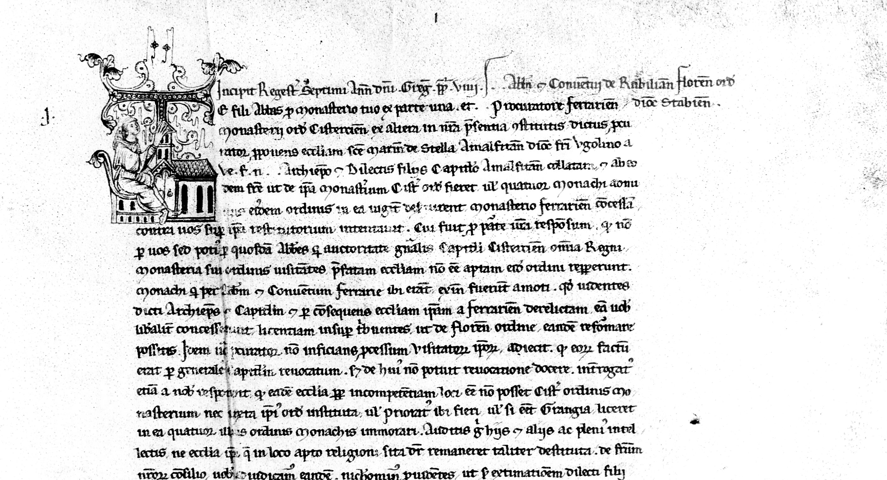

# Annotation historischer Regesten

---

Die Annotation von Regesten – verdichteten Inhaltszusammenfassungen historischer Urkunden – steht im Mittelpunkt unseres
Forschungsprojekts. Ziel ist es, Begriffe, Namen und Konzepte in diesen Texten systematisch zu erfassen und sie dadurch
sowohl für die historische Forschung als auch für digitale Verfahren nutzbar zu machen. Auf diese Weise entsteht eine
Forschungsdatenbasis, die den Anschluss an moderne Methoden der Digital Humanities eröffnet und zugleich die
philologische Präzision der Geschichtswissenschaft wahrt.

---

Unsere Annotationsrichtlinien beruhen auf einer doppelten Grundlage: Zum einen orientieren sie sich an der einschlägigen
Forschungsliteratur, die seit Jahrzehnten Maßstäbe im Umgang mit den Regesten setzt. Zum anderen greifen sie Impulse
einer eigens durchgeführten Umfrage in der Fachgemeinschaft auf, in der Historikerinnen und Historiker ihre aktuellen
wie auch geplanten Forschungsvorhaben skizziert haben. So verbinden wir tradierte Forschungsperspektiven mit den
Fragestellungen, die heute und in Zukunft an das *Repertorium Germanicum* herangetragen werden.

---

Im Zentrum der Arbeit steht die konsequente Auszeichnung jener Begriffe, die im Regesttext explizit erscheinen.
Implizite Bezüge, verkürzte Hinweise oder bloß vorausgesetzte Kontexte werden bewusst ausgeklammert, um eine klare
Trennung zwischen Quellenbefund und Interpretation zu gewährleisten. Diese methodische Strenge wird durch den gezielten
Einsatz digitaler Werkzeuge ergänzt: Nicht annotierte Inhalte können durch KI-gestützte Verfahren identifiziert werden,
wodurch sich eine produktive Balance zwischen manueller Genauigkeit und algorithmischer Verarbeitung ergibt.

---

Die Struktur des Annotationsschemas orientiert sich an sogenannten basalen Kategorien, kleinsten logisch abgrenzbaren
Einheiten, die den Text erschließen. Derzeit sind sie zu den vier Bereichen Person, Vita, Event und Varia
zusammengefasst. Diese Ordnung dient der Übersichtlichkeit, bildet aber nicht den Endpunkt der Entwicklung.
Perspektivisch entstehen semantische Kategorien, die aus Kombinationen der Basiseinheiten hervorgehen und damit in der
Lage sind, komplexere historische Zusammenhänge sichtbar zu machen. Dass eine einzelne Textstelle mehreren Kategorien
zugeordnet werden kann, spiegelt die Vielschichtigkeit historischer Wirklichkeit wider.

---

Ein zentrales Anliegen unseres Projekts ist zudem die Transparenz. Jede Kategorie wird mit Beispielen dokumentiert, die
den annotierten Kontext präzise veranschaulichen. Durch die Unterscheidung zwischen Standard- und Sonderbeispielen wird
Konsistenz gewährleistet, zugleich aber auch Raum für flexible Anpassungen geschaffen. Diese klare Dokumentation
erleichtert den Einstieg für neue Projektteilnehmerinnen und -teilnehmer und sorgt dafür, dass das System offen für
Weiterentwicklungen bleibt.

---

Mit der Annotation der Regesten schaffen wir eine Grundlage, um historische Quellenbestände nicht nur als Träger
einzelner Informationen zu lesen, sondern als strukturierte Korpora, deren innere Ordnung für die Forschung sichtbar
wird. Indem philologische Genauigkeit mit digitaler Verarbeitung verknüpft wird, entstehen neue Zugänge zu einem
Material, das seit Jahrhunderten die Geschichtswissenschaft prägt. Die daraus gewonnenen Daten ermöglichen nicht nur
feinere Analysen innerhalb der Geschichtswissenschaft, sondern machen die Quellen zugleich für interdisziplinäre
Perspektiven nutzbar – von der Kirchengeschichte über die Sozial- und Kulturgeschichte bis hin zu Fragen politischer und
institutioneller Entwicklung.  
