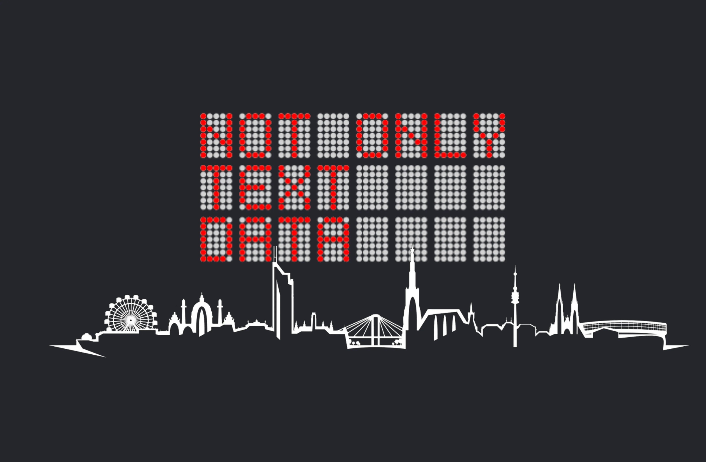

## HisQu at the DHd in Vienna!

At the annual **Digital Humanities im deutschsprachigen Raum (DHd)** conference in Vienna, the **HisQu initiative** (
“Forschungsdateninfrastruktur für historische Quellen”) was presented as an ambitious effort to rethink how historians
engage with their sources in the digital age. Supported by the DFG with a budget of 1.9 million euros, the project
brings together partners from Jena, Göttingen, Erfurt, and Rome to design an infrastructure that makes historical
sources more accessible, more analyzable, and more transparent.

### 🌍 What is HisQu?

Historians have always worked by collecting, reading, and comparing sources to answer research questions. Traditionally
this meant long days in archives and libraries, stacks of index cards, and painstaking synthesis. Today, more and more
of this work is being transformed by **digital resources and computational methods**. HisQu responds to this shift by
creating a **modular research data infrastructure** that allows sources to be digitized, semantically enriched, and
systematically analyzed.

### 📚 The Data Basis: Medieval Church History

As a starting point, the project focuses on **regesta** — structured summaries of medieval documents relating to church
history. These have long served as entry points for researchers, but they were never designed to be read by machines.
HisQu converts these collections into **semantically structured data**, enabling queries across vast corpora of
sources.  
With this approach, scholars can filter for persons, places, legal acts, or property relations — and, for example, track
financial flows between the Vatican and German church officials across centuries.

### 🧩 Methods and Ontologies

To make such analyses possible, HisQu develops **ontologies** — controlled category systems tailored to church history
and canon law. Instead of inventing categories from scratch, the project reconstructs the conceptual structures implicit
in centuries of scholarship. These ontologies become the backbone for semantic enrichment and computational analysis,
supporting network analyses, temporal studies, and geospatial explorations.

### 🗄️ Knowledge Storage with FactGrid

A central component of the initiative is **FactGrid**, a Wikibase-powered platform that works like a collaborative
database for historians. It enables HisQu researchers to connect their data with international standards and projects
like Wikidata. Complex relationships between people, institutions, events, and places can thus be represented in a
transparent, reusable way — building **dynamic knowledge networks** for historical research.

### 📓 Digital Lab Notebook

One of the most innovative aspects of HisQu is the **digital lab notebook**. Every step in the analytical workflow is
documented, ensuring that results are **transparent, reproducible, and reusable**. This practice, common in the natural
sciences, is here adapted for the humanities, opening new pathways for collaboration and methodological exchange.

### 🤝 Collaboration Across Disciplines

The project thrives on the collaboration of historians and computer scientists, especially at the University of Jena
where the initiative is coordinated. This interdisciplinary dialogue is not always easy — it requires developing a
common language across very different traditions — but it is precisely here that the potential for innovation lies. By
building a shared infrastructure, HisQu is laying the groundwork for **future digital scholarship across historical
domains**.

---

The presentation of HisQu at the **DHd in Vienna** highlighted how **digital infrastructures** are reshaping historical
research. By combining semantic enrichment, collaborative databases, and reproducible workflows, HisQu is not only
making medieval sources more accessible but also setting methodological standards for the future of the Digital
Humanities.
